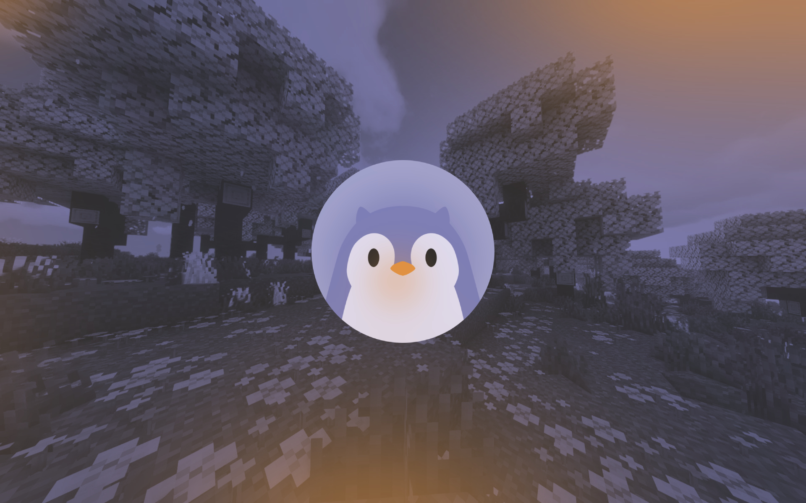

# 🚀 Trinity Launcher Website

<div align="center">



**Sitio web oficial de Trinity Launcher - El launcher open source para Minecraft Bedrock en Linux**

[](https://trinitylauncher.vercel.app)
[](LICENSE)
[](https://vercel.com)

[🌐 Sitio Web](https://trinitylauncher.vercel.app) • [📖 Wiki](https://trinitylauncher.vercel.app/pages/wiki.html) • [❓ FAQ](https://trinitylauncher.vercel.app/pages/faq.html) • [👥 Equipo](https://trinitylauncher.vercel.app/pages/contributors.html)

</div>

## 📋 Descripción

Sitio web moderno y responsive de Trinity Launcher, construido con tecnologías web estáticas. Incluye documentación completa, preguntas frecuentes, información del equipo y recursos para la comunidad.

### ✨ Características principales

- 🎨 **Diseño moderno** con modo oscuro y animaciones suaves
- 📱 **Completamente responsive** para todos los dispositivos
- ⚡ **Carga rápida** con contenido optimizado
- 🔍 **SEO optimizado** con meta tags completos
- 📊 **Analytics integrado** y datos estructurados
- 🧩 **Sistema modular** para fácil mantenimiento
- 🔄 **Contenido dinámico** cargado desde JSON/HTML

## 🛠️ Tecnologías utilizadas

- **Frontend**: HTML5, CSS3, JavaScript ES6+
- **Styling**: [Tailwind CSS](https://tailwindcss.com/) + CSS personalizado
- **Iconos**: [Font Awesome 6](https://fontawesome.com/)
- **Deployment**: [Vercel](https://vercel.com/)
- **Optimización**: Compresión de imágenes, minificación CSS/JS

## 📁 Estructura del proyecto

```

trinity-launcher-website/  
├── 📂 assets/ # Recursos estáticos  
│ ├── 📂 icons/ # Favicons e iconos SVG  
│ └── 📂 images/ # Imágenes optimizadas  
├── 📂 css/ # Hojas de estilo  
│ ├── 📄 main.css # Estilos principales  
│ └── 📄 components.css # Componentes específicos  
├── 📂 data/ # Contenido dinámico  
│ ├── 📄 contributors.json # Información del equipo  
│ ├── 📂 faq-content/ # Sistema FAQ modular  
│ │ ├── 📄 config.json # Configuración FAQs  
│ │ └── 📄 [1-9].html # Respuestas individuales  
│ └── 📂 wiki-content/ # Documentación modular  
│ ├── 📄 configs.json # Configuración Wiki  
│ └── 📄 *.html # Artículos de documentación  
├── 📂 js/ # Scripts JavaScript  
│ ├── 📄 main.js # Funcionalidad principal  
│ ├── 📄 navigation.js # Navegación dinámica  
│ ├── 📄 tailwind.config.js # Configuración Tailwind  
│ └── 📄 utils.js # Utilidades comunes  
├── 📂 pages/ # Páginas secundarias  
│ ├── 📄 contributors.html # Página del equipo  
│ ├── 📄 faq.html # Preguntas frecuentes  
│ └── 📄 wiki.html # Documentación  
├── 📄 index.html # Página principal  
└── 📄 vercel.json # Configuración de despliegue

```

## Instalación y desarrollo

### Prerrequisitos

- **Navegador web moderno** (Chrome, Firefox, Safari, Edge)
- **Servidor local** (recomendado para desarrollo)

### Desarrollo local

1. **Clona el repositorio**
   ```bash
   git clone https://github.com/Trinity-LA/Trinity-Website.git
   cd Trinity-Website
``

2. **Inicia un servidor local**
    
    **Opción 1: Python**
    
    ```bash
    python -m http.server 8000
    # O con Python 3
    python3 -m http.server 8000
    ```
    
    **Opción 3: VS Code Live Server**
    
    - Instala la extensión "Live Server"
    - Click derecho en `index.html` → "Open with Live Server"


